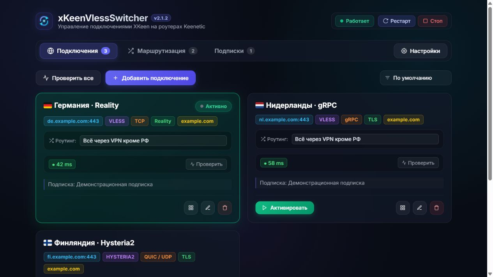
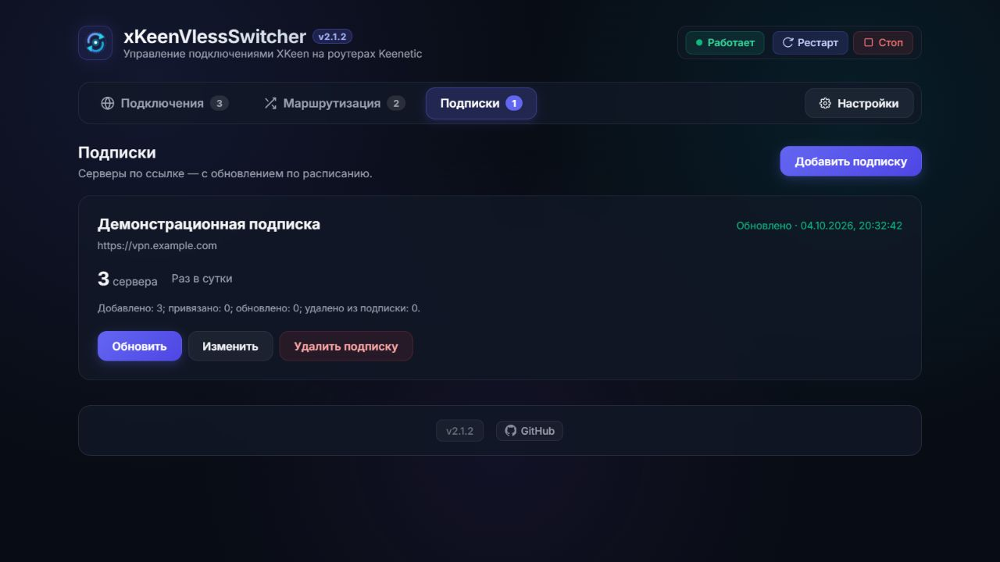
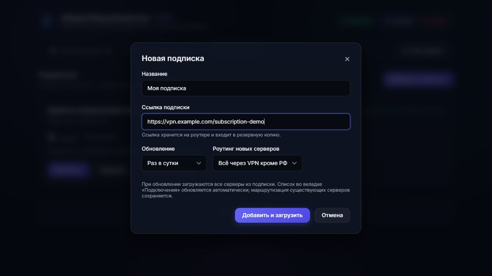

# 🚀 xKeenVlessSwitcher

**xKeenVlessSwitcher** — веб-панель для XKeen с импортом подписок по ссылке, обновлением серверов и настройкой маршрутизации. Основана на [sergey1900/XKeenSwitcher](https://github.com/sergey1900/XKeenSwitcher). Версия 2.1.2.

Быстрая установка в Entware:

```sh
curl -fsSL https://raw.githubusercontent.com/Jack13PythonLearn/xKeenVlessSwitcher/main/install.sh | sh
```

Для закрытого репозитория эта команда и встроенное обновление без авторизации недоступны. Сборку можно передать на роутер локально, сохранив каталог `data`.

Веб-панель для управления подключениями и маршрутизацией **XKeen / Xray** на роутерах с установленной средой **Entware** (Keenetic, OpenWrt и др.). Импорт подписок создаёт конфигурации Xray.

<p align="center">
  
</p>





На скриншотах показаны демонстрационные адреса, ключи и результаты проверки.

## Подписки по ссылке

1. Откройте **Подписки → Добавить подписку**.
2. Введите название и ссылку провайдера, выберите расписание и маршрутизацию для новых серверов.
3. Нажмите **Добавить и загрузить**. Серверы появятся во вкладке **Подключения**, где их можно проверить и включить.

Поддерживаются обычный текст и Base64 со ссылками `vless://`, `hy2://` и `hysteria2://`. VLESS: TCP/RAW, gRPC, WebSocket и базовый XHTTP; TLS/Reality, ALPN и закрепление сертификата через `pcs`. Для Hysteria2 требуется сборка Xray с поддержкой этого протокола. Его доступность проверяется через временный туннель Xray, поскольку TCP-проверка не подходит для UDP.

Список обновляется вручную или раз в 1, 6, 12, 24, 72 либо 168 часов, пока панель запущена. При каждом обновлении загружаются все поддерживаемые серверы провайдера, а вкладка **Подключения** обновляется автоматически. Дата и время последней успешной загрузки показаны рядом со статусом **Обновлено**. Проверка доступности запускается отдельно.

Обновление не переключает активный сервер и не перезапускает XKeen. Для существующих серверов сохраняются ID, пользовательские названия, маршрутизация и настройки резерва. Изменение SNI обновляет однозначно сопоставленный профиль без дублей; несколько вариантов SNI в одной подписке остаются отдельными подключениями. При смене адреса или ключей создаётся новое подключение; отсутствующий активный, резервный или изменённый вручную сервер остаётся с пометкой для проверки.

Старые исключения и прежний отбор не ограничивают загрузку. Удалённый вручную сервер вернётся при следующем обновлении, если он ещё есть у провайдера. Удаление самой подписки сохраняет её серверы как обычные подключения.

Если название сервера содержит флаг, он используется в карточках и списках выбора. Флаг GeoIP добавляется только при отсутствии флага в названии.

Пустой ответ, ошибка сети или повреждённая поддерживаемая ссылка не удаляют серверы. Неизвестные протоколы пропускаются с предупреждением; при таком частичном ответе прежние серверы не удаляются. Clash YAML, sing-box JSON, VMess, Trojan, Shadowsocks, расширение XHTTP `extra`, обфускация и диапазоны портов Hysteria2 пока не поддерживаются.

Нужен Node.js 18+. Дополнительных npm-зависимостей нет. Ссылка загружается роутером с публичного HTTP/HTTPS-сервера с проверкой TLS; локальные адреса и перенаправления на них запрещены. Ограничения: 20 секунд, 8 МБ, 5000 записей, 5 перенаправлений. Ссылка скрыта в обычных ответах API, но хранится в `data/profiles.json` и включается в ZIP/JSON-резервную копию вместе с ключами серверов. Панель, как и исходная версия, предназначена для доверенной локальной сети и не имеет собственной авторизации.

Установщик и проверка обновлений этого форка используют `Jack13PythonLearn/xKeenVlessSwitcher`. Обновления исходного репозитория не заменят доработки автоматически.

### Проверка разработки

```sh
node --test
```

Тесты используют временные файлы и искусственные серверы, без доступа к настройкам роутера. Для локального просмотра можно задать `XKEEN_DATA_DIR`, `HOST=127.0.0.1`, `PORT` и `XKEEN_DISABLE_BACKGROUND=1`, затем запустить `node server.js`. Последняя переменная выключает фоновые проверки и расписание подписок; не задавайте её в рабочей установке.


---

## ✨ Возможности

- ⚡ **Переключение в 1 клик:** Мгновенная смена активного сервера с автоперезапуском службы XKeen и проверкой задержки (ping/RTT).
- 🛡️ **Отказоустойчивость (Failover & Auto-Failover):** 
  - Непрерывный мониторинг доступности внешних ресурсов и белых списков РФ.
  - Автоматическое переключение на резервный узел или пул серверов (Lowest Ping / Round-Robin).
  - Автовозврат на основной сервер при восстановлении связи.
- 🌐 **Модульная система роутингов:** 
  - Системные защищённые пресеты (*«Всё через VPN»*, *«Всё через VPN кроме РФ»*).
  - Создание и привязка персональных роутингов к подключениям.
- 📱 **QR-коды и экспорт:** Генерация ссылок подключения (VLESS / Hysteria2) и QR-кодов для быстрой настройки смартфонов.
- 📂 **Умный редактор конфигураций:** Создание, форматирование, подсветка синтаксиса и валидация `outbound.json` и `routing.json` (с поддержкой комментариев `//` и `/* */`).
- 📦 **Резервное копирование:** Быстрый экспорт и импорт базы подключений и роутингов в архивах ZIP и файлах JSON.
- 📊 **Мониторинг службы XKeen:** Проверка статуса, запуск, остановка, перезапуск и просмотр логов терминала прямо в веб-интерфейсе.
- 🎨 **Современный Glassmorphism UI:** Адаптивный дизайн для мобильных устройств и десктопа с поддержкой флагов стран серверов.
- 🔄 **Встроенное автообновление:** Проверка новых релизов на GitHub прямо в интерфейсе и обновление в 1 клик с автоматическим бэкапом конфигураций и перезапуском сервера.

---

## 📥 Быстрая установка в Entware

Подключитесь к роутеру по SSH и выполните одну команду:

```bash
curl -fsSL https://raw.githubusercontent.com/Jack13PythonLearn/xKeenVlessSwitcher/main/install.sh | sh
```

*(Если репозиторий приватный, скрипт запросит GitHub Token или вы можете передать его заранее: `GITHUB_TOKEN="ваш_токен" sh install.sh`)*

Веб-панель будет доступна по адресу: **`http://192.168.1.1:3000`** *(или IP вашего роутера)*.

### Что делает скрипт установки:
1. Проверяет наличие среды Entware и необходимых утилит (`node`, `curl`, `tar`, `ca-certificates`). При необходимости автоматически доустанавливает их через `opkg`.
2. Скачивает и распаковывает приложение в каталог `/opt/etc/xkeen-switcher`.
3. Автоматически находит существующие конфиги Xray/XKeen (`05_outbounds.json`, `05_routing.json` и др.) и импортирует их.
4. Настраивает и запускает службу автозапуска `/opt/etc/init.d/S99xkeen-switcher`.

---

## 🔄 Обновление

- **Способ 1 (через веб-интерфейс):** Если доступна новая версия, в нижнем баре появится кнопка **«Обновить»**. Нажмите её и подтвердите запуск — панель сама скачает обновление, сохранит бэкап настроек и перезапустится.
- **Способ 2 (через терминал):** Запустите команду установки повторно:
  ```bash
  curl -fsSL https://raw.githubusercontent.com/Jack13PythonLearn/xKeenVlessSwitcher/main/install.sh | sh
  ```
  Ваши настройки и профили (`data/profiles.json`) сохранятся автоматически.

---

## 🛠️ Управление службой вручную

- **Статус службы:** `/opt/etc/init.d/S99xkeen-switcher status`
- **Запуск:** `/opt/etc/init.d/S99xkeen-switcher start`
- **Остановка:** `/opt/etc/init.d/S99xkeen-switcher stop`
- **Перезапуск:** `/opt/etc/init.d/S99xkeen-switcher restart`
- **Просмотр логов:** `tail -f /opt/var/log/xkeen-switcher.log`

---

## 🗑️ Удаление

```bash
curl -fsSL https://raw.githubusercontent.com/Jack13PythonLearn/xKeenVlessSwitcher/main/uninstall.sh | sh
```
Скрипт остановит службу, удалит файлы приложения и предложит опционально удалить Node.js.
