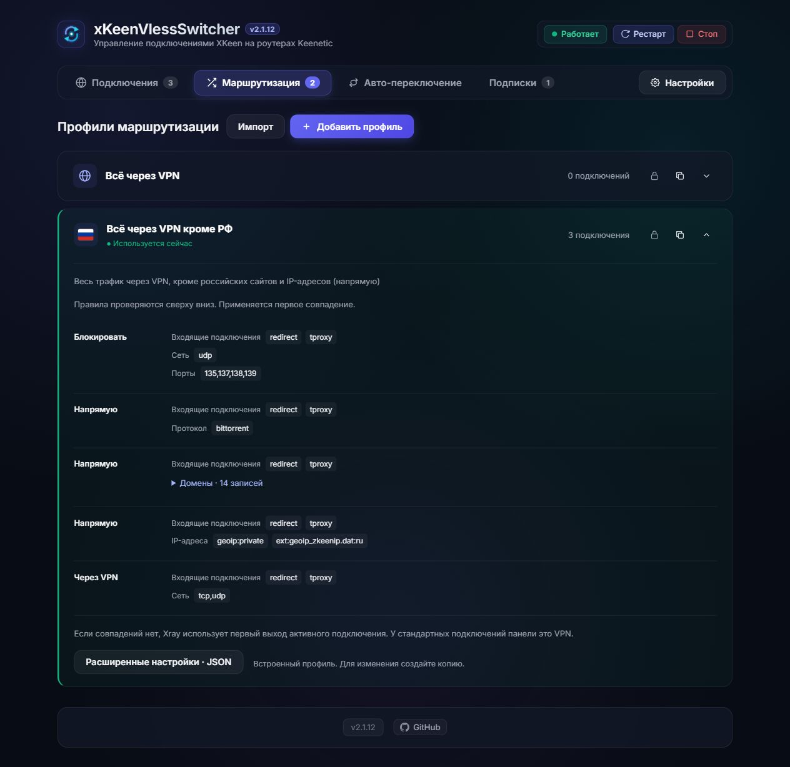
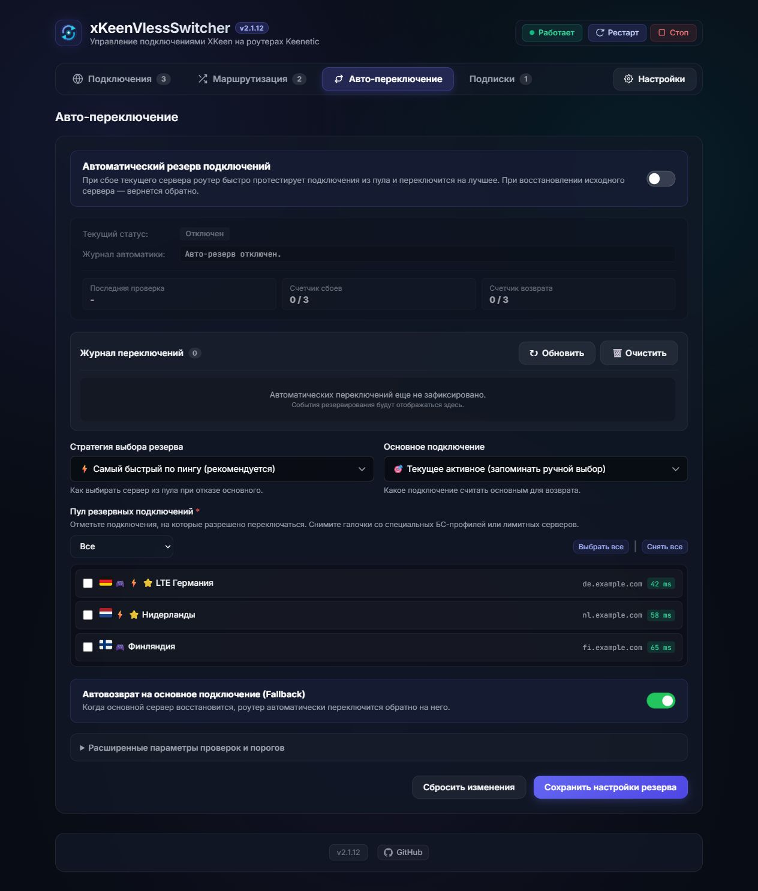
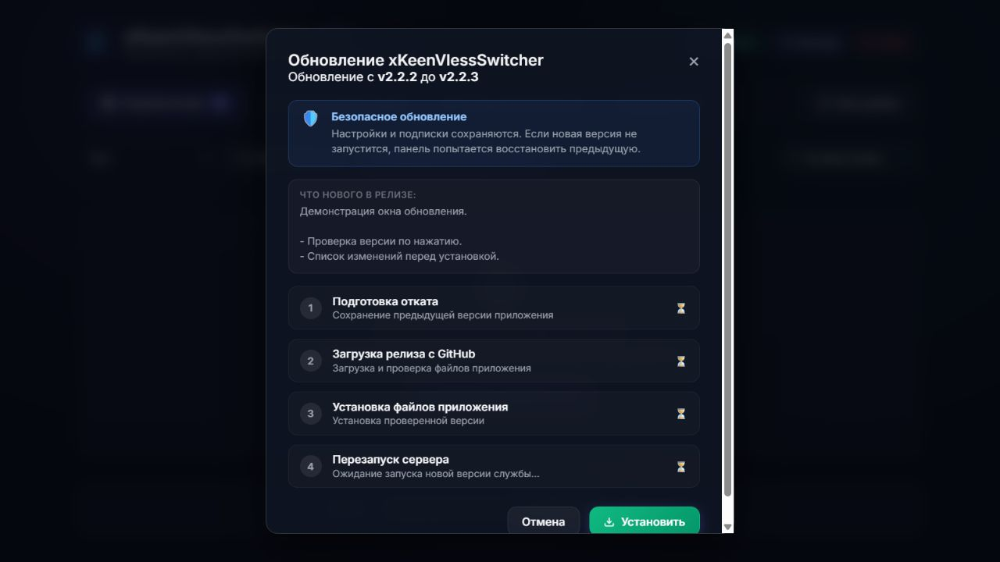

# xKeenVlessSwitcher

Веб-панель для управления XKeen на роутерах с Entware. Версия — **2.2.4**.

- Компактный список подключений: флаги, пинг, активация и фильтр LTE / обычные серверы.
- Импорт подписок VLESS и Hysteria2, обновление по расписанию, трафик и срок действия.
- Профили маршрутизации: весь трафик через VPN или российские ресурсы напрямую.
- Синхронизация доменных списков с проверкой версии источников.
- Авто-переключение на резервный сервер и возврат на основной.
- Резервное копирование и восстановление настроек.


<details>
<summary>Другие экраны</summary>

### Подписки


### Добавление подписки


### Маршрутизация



### Авто-переключение



### Обновление приложения



</details>

На скриншотах используются демонстрационные данные.

## Установка

Нужны Entware, установленный XKeen/Xray и Node.js 18+. Поддержка Hysteria2 зависит от сборки Xray.

В SSH-сессии Entware на роутере выполните:

```sh
curl -fsSL https://raw.githubusercontent.com/Jack13PythonLearn/xKeenVlessSwitcher/main/install.sh -o /opt/tmp/xkeen-vless-switcher-install.sh && /opt/bin/sh /opt/tmp/xkeen-vless-switcher-install.sh
```

Если curl ещё не установлен: `/opt/bin/opkg update && /opt/bin/opkg install curl ca-bundle`.

Для публичного репозитория установка не требует GitHub-токена. Установщик добавит необходимые пакеты и службу автозапуска. После установки откройте `http://IP-роутера:3000`. Панель предназначена для доверенной локальной сети.

### Что делает установщик

- Проверяет Entware и находит конфигурации XKeen/Xray.
- Устанавливает недостающие зависимости: Node.js, curl, tar и сертификаты HTTPS.
- Загружает приложение из ветки `main` на GitHub в `/opt/etc/xkeen-switcher`.
- При обновлении сохраняет подключения, подписки, маршрутизацию и настройки в `data/profiles.json`.
- При первой установке создаёт настройки и подключение `Default` из текущей конфигурации Xray.
- Создаёт службу автозапуска `/opt/etc/init.d/S99xkeen-switcher` и запускает панель на порту `3000`.

XKeen/Xray установщик не устанавливает и его конфигурации не меняет. Подписку нужно добавить отдельно в панели.

## Обновление

Перед обновлением скачайте резервную копию: **Настройки → Резервная копия**.

**Через SSH, без токена:** повторно запустите установщик. Он обновит файлы панели, сохранит подключения, подписки, профили маршрутизации и настройки, затем перезапустит панель.

```sh
curl -fsSL https://raw.githubusercontent.com/Jack13PythonLearn/xKeenVlessSwitcher/main/install.sh -o /opt/tmp/xkeen-vless-switcher-install.sh && /opt/bin/sh /opt/tmp/xkeen-vless-switcher-install.sh
```

**Через веб-интерфейс:** нажмите номер версии внизу панели, просмотрите изменения и нажмите «Установить». В версии 2.2.4 этот способ требует GitHub-токен даже для публичного репозитория. [Настройка токена и откат](docs/UPGRADE-2.2.1.md).

## Удаление

В SSH-сессии Entware выполните:

```sh
/opt/bin/sh /opt/etc/xkeen-switcher/uninstall.sh
```

Скрипт остановит панель и удалит её службу автозапуска. На вопрос об удалении файлов ответьте `y`, чтобы удалить панель вместе с подключениями, подписками и настройками, или `n`, чтобы оставить файлы. Если данные нужны, заранее скачайте резервную копию.

На вопрос об удалении Node.js по умолчанию выбран ответ `n`: оставьте его, если Node.js нужен другим приложениям. XKeen/Xray и его конфигурации скрипт не удаляет.

## Источники доменов

- [v2fly/domain-list-community](https://github.com/v2fly/domain-list-community/tree/master/data) — выбранные списки сервисов и их зависимости.
- [itdoginfo/allow-domains](https://github.com/itdoginfo/allow-domains/blob/main/Russia/outside-raw.lst) — российские ресурсы для прямого подключения.

Состав списков: [routing-sources.json](lib/routing-sources.json). Обновление — вручную или раз в неделю. Если версия источников не изменилась, панель сообщает об этом и не перезаписывает правила.

## Изменения и проверка

[История изменений](CHANGELOG.md). Автоматические тесты: `npm test` — 89 тестов. [Результаты и ограничения проверки 2.2.4](docs/TESTING-2.2.4.md).

Основано на [XKeenSwitcher](https://github.com/sergey1900/XKeenSwitcher). Лицензия флагов: [MIT](public/flags-LICENSE.txt).
