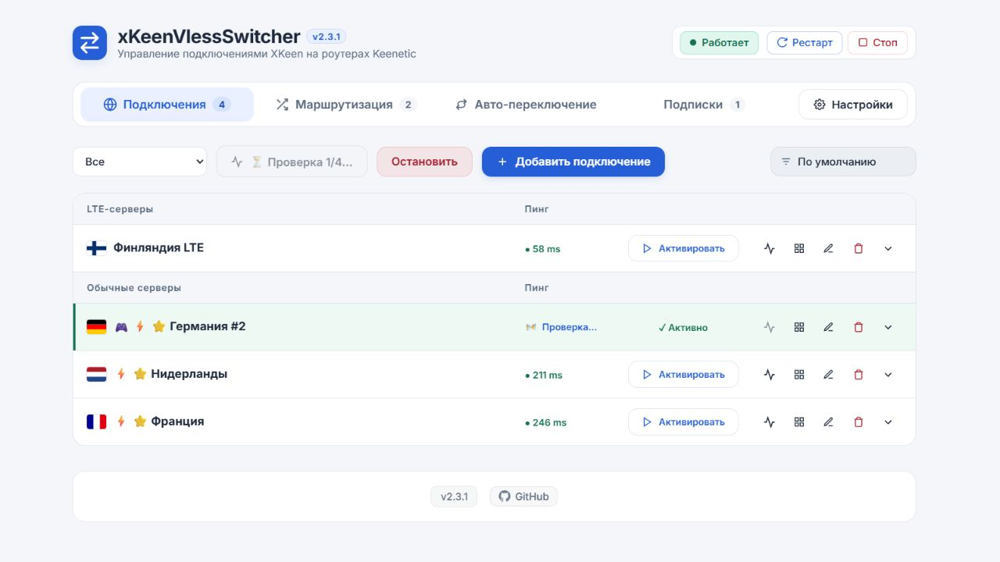

# Проверка 2.3.1

Дата: 05.10.2026.

- 97 автоматических тестов: все прошли. Включены остановка очереди, сохранение текущего результата, повторный запуск, ошибка запроса, пустой список и исправление старого имени Default без изменения активного ID.
- На локальном стенде проверка остановлена после первого из четырёх серверов; у остальных время проверки не изменилось. Повторный запуск и остановка работают.
- Старый импортированный профиль Default показан с названием и флагом из подписки; пользовательские имена сохранены.
- Кнопка остановки проверена в браузере на обычной ширине и 390 px; горизонтальной прокрутки нет. Ошибок JavaScript нет.
- Остановка завершает текущий запрос и не запускает следующие. Она не помечает непроверенные серверы недоступными.

