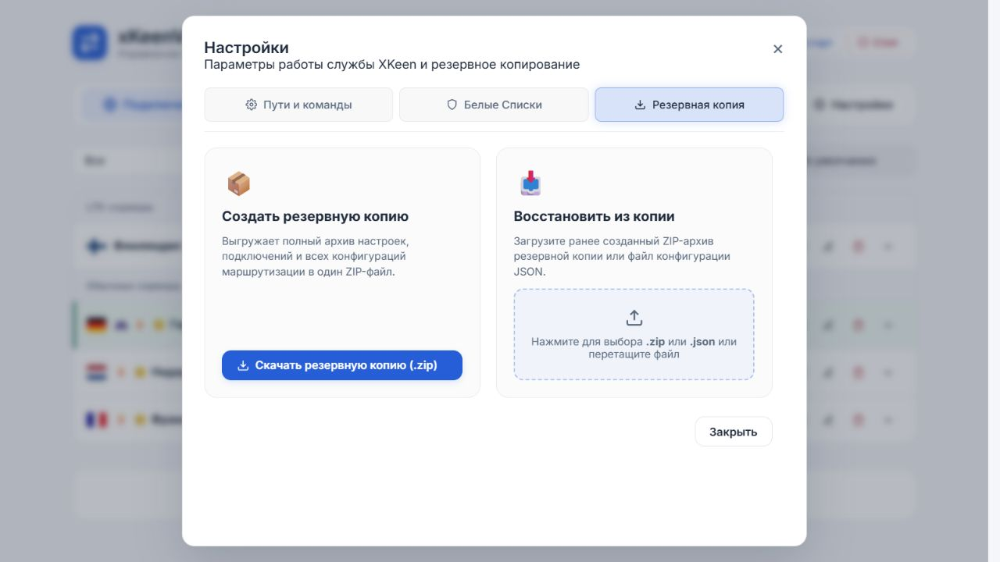

# Проверка 2.3.2

Дата: 05.10.2026.

- В 2.3.1 на экране 1440×1000 верх окна менялся с 57,6 до 191 и 50 px; ширина навигации менялась при появлении прокрутки.
- После исправления координаты и размеры окна и навигации совпадают при переключении между «Пути и команды», «Белые Списки» и «Резервная копия». Проверено на 1440×1000, 1024×768, 390×844 и 320×640.
- Все три кнопки имеют одинаковые размеры (погрешность округления браузера менее 0,02 px). Горизонтальной прокрутки нет.
- Длинная вкладка прокручивается внутри окна, заголовок и навигация остаются на месте; переход на другую вкладку сбрасывает прокрутку к началу.
- Tab с последней кнопки возвращает фокус к закрытию окна; Escape закрывает окно и возвращает фокус к кнопке «Настройки».
- Ошибок JavaScript не обнаружено. Все 97 автоматических тестов прошли.
- Проверено на локальном стенде с демонстрационными данными. На роутер релиз не устанавливался — пользователь обновляет самостоятельно.

