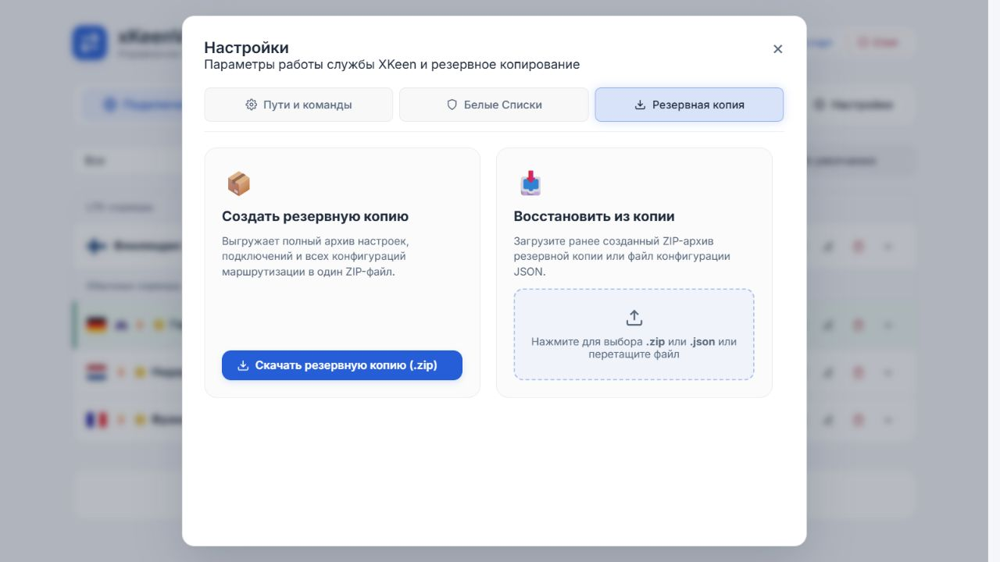

# Проверка 2.3.3

Дата: 05.10.2026.

- Все 97 автоматических тестов прошли.
- На локальном стенде подтверждено отсутствие нижней кнопки «Закрыть» во вкладке «Резервная копия».
- Крестик в шапке и Escape закрывают окно; фокус возвращается к кнопке «Настройки».
- На роутер обновление не устанавливалось.

