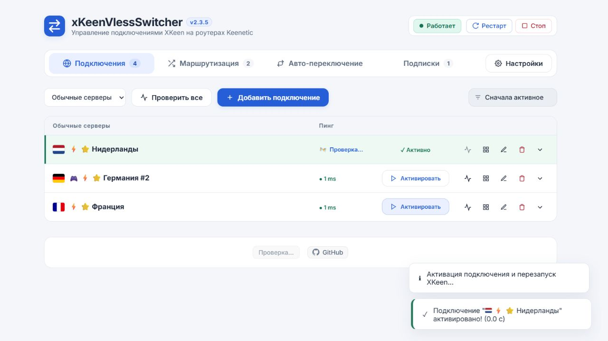

# Проверка 2.3.5

Дата: 05.10.2026.

## Результаты

- Все 109 автоматических тестов прошли (`node --test test/*.test.js`).
- Новые API-тесты: успешное применение и сохранение основного сервера; отсутствие обязательного пинга в ответе активации; замеры этапов; отказ при некорректном JSON, ошибке перезапуска и неподтверждённом запуске. При отказах сохранены предыдущие файлы и активный сервер.
- Новые тесты интерфейса: результат активации отображается до завершения пинга; повторное нажатие не создаёт запрос; при ошибке состояние перечитывается; поздний пинг не меняет активный сервер; результат для изменившейся конфигурации отбрасывается.
- В браузере проверены переключение, фоновый пинг, сортировки «Сначала активное» и «По пингу», сохранение раскрытых параметров. Ошибок JavaScript не обнаружено.
- На стенде из 532 синтетических подключений проверены фильтр обычных серверов и перемещение активного сервера в начало своей группы. Активация отображается до завершения пинга, кнопки снова доступны.

## Измерения и ограничения

Из обязательного ожидания удалены 1200 мс и отдельная проверка доступности сервера. Время проверки конфигурации и штатного перезапуска XKeen остаётся зависимым от роутера.

Ответ `POST /api/connections/:id/activate` содержит `timings`: `queueMs`, `validationMs`, `writeMs`, `restartMs`, `persistMs`, `totalMs`; при выполнении команд также `restartCommandMs` и `statusMs`. `restartMs` включает команду перезапуска и проверку статуса — эти вложенные значения не нужно суммировать повторно.

На локальном стенде используются демонстрационные данные и команды-заглушки службы. Скорость перезапуска и реальный VPN-трафик на роутере в этом релизе не измерялись. Установка на роутер остаётся пользователю через кнопку версии.

