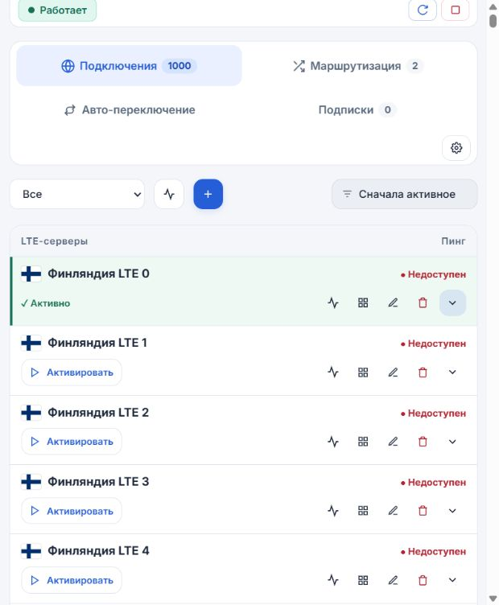

# Проверка 2.4.0

Дата: 05.10.2026.

## Результаты

- 123 автоматических теста прошли: node --test test/*.test.js.
- Проверены очистка старых служебных копий, сохранение текущего отката и блокировка очистки во время установки/неудачного отката.
- Три последовательных обновления оставляют ровно одну копию отката. Откат восстанавливает предыдущий код; пользовательские данные сохранены.
- Проверены отказ при нехватке места, сжатый откат и прежние сценарии отказа запуска.
- 532 результата пинга объединяются в одну компактную запись. Отдельный API-тест подтверждает отсутствие изменения profiles.json и last-good при пинге.
- Устаревшие результаты не применяются к изменённому outbound; удалённые ID очищаются.
- Все 257 флагов распакованы и сверены по хешам. Проверены gzip, ETag/304, выдача без сжатия и недоступность внутреннего пакета по HTTP.
- Проверены компактный API на 1000 подключений и отдельная загрузка полного outbound.
- В браузере: 1000 строк, ноль созданных скрытых блоков параметров до раскрытия; после раскрытия — один. Проверены редактор outbound, QR-код, фильтр обычных серверов (900), возврат к 1000 серверам и остановка массового пинга. Ошибок и предупреждений JavaScript не обнаружено.
- Установщик прошёл bash -n; архив читается штатным tar и содержит 30 рабочих файлов. Проверена воспроизводимость сборки и отсутствие data/docs/test в архиве.

## Измерения

| Метрика | До | После |
|---|---:|---:|
| Рабочие файлы, байт | 2 849 442 | 1 183 058 |
| Установочный архив, байт | полный архив репозитория | 771 478 |
| Ответ API, 1000 синтетических серверов, байт | 1 647 922 | 480 922 |

Рабочие файлы уменьшены примерно на 58%, ответ API на этом стенде — на 71%. Размер ответа зависит от содержимого подписки. Размеры файлов логические: сжатие UBIFS и выделение блоков на роутере дадут другие значения.

## Ограничения и проверка после установки

На роутер релиз не устанавливался. Реальный объём освобождённого места, RAM/CPU и задержка XKeen на этом устройстве не измерены. Показанные в интерфейсе роутера 92,7 МБ относятся ко всему разделу OPKG, а не только к панели. Node.js, Xray и geodata не удаляются.

После обновления пользователем: проверить запуск панели, подписку, активацию и прямую маршрутизацию; сравнить свободное место до и после минуты работы. GET /api/app/storage возвращает размер кода, данных, свободное место и память процесса (freeBytes может быть null в старых Node.js без statfsSync).

Первое обновление запускает worker предыдущей версии, поэтому текущая копия отката может оставаться несжатой до следующего обновления. Очистка старых копий начинается спустя 30 секунд после запуска и повторяется раз в минуту. Журнал при превышении 256 КиБ сокращается до последних 128 КиБ; между проверками он может вырасти.

Пинг сбрасывается на диск раз в 30 секунд; при внезапном отключении питания допускается потеря последних замеров. Настройки и конфигурации сохраняются сразу.

Для каждого следующего релиза: собрать runtime, проверить контрольную сумму и состав архива, выполнить полный набор тестов и повторить браузерные сценарии для затронутых функций; обновить CHANGELOG и отчёт.

