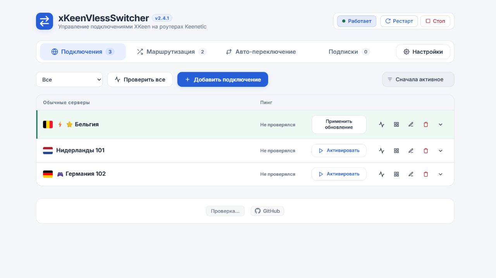

# Проверка 2.4.1

Дата: 05.10.2026.

Причина: кнопка «Применить обновление» имела класс btn-secondary и не получала стили btn-activate, включая размер текста и мобильное размещение. При ширине кнопки 140 px текст занимал 190 px и выходил на соседние значки.

Исправление: размеры, перенос текста и размещение привязаны к общему классу connection-activation. Логика применения конфигурации не изменялась. Надпись остаётся при изменении параметров активного сервера из подписки.

- Все 123 автоматических теста прошли.
- Ошибка воспроизведена на локальном стенде с активным сервером requiresActivation=true.
- В браузере проверены ширины 1280, 768 и 375 px: scrollWidth кнопки равен clientWidth; пересечений с блоком значков и горизонтальной прокрутки страницы нет.
- Проверены соседние обычные кнопки «Активировать».
- Пересобран компактный установочный архив; все рабочие файлы сверены с деревом релиза.
- На роутер исправление не устанавливалось; обновление выполняет пользователь кнопкой версии.

